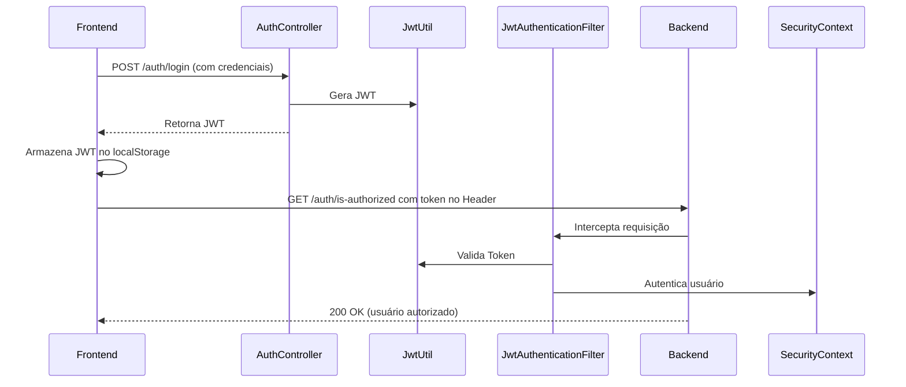

# 🏢 Tenant Mobile Backend

Este repositório apresenta um sistema completo de autenticação JWT e gerenciamento multitenancy, originalmente desenvolvido por mim durante minha atuação profissional na organização **German Tech**.

> 🔐 Projeto reestruturado para fins de portfólio. Informações sensíveis da empresa foram removidas ou adaptadas para garantir confidencialidade.

---

## 📌 Visão Geral

O Tenant Mobile Backend é uma API REST desenvolvida com **Spring Boot** que oferece:

- Autenticação e autorização com **JWT Token**.
- Suporte a múltiplos clientes (tenants).
- Camada de segurança customizada com `SecurityFilterChain` e `JwtAuthenticationFilter`.
- Integração com **PostgreSQL**.
- Código modular e orientado a boas práticas do Spring.

---

## 🧱 Tecnologias Utilizadas

- Java 21
- Spring Boot 3
- Spring Security
- JWT (JSON Web Token)
- JPA / Hibernate
- PostgreSQL
- Maven

---

## 🔁 Fluxo da Autenticação (JWT)



---

## 🔎 Estrutura de Pacotes

```
com.maccari.tenant_mobile_backend
├── Config                   # Configuração de segurança
├── Controller               # Endpoints REST
├── DTO                     # Data Transfer Objects
├── Model                   # Entidades JPA
├── Repository              # JPA Repositories
├── Service                 # Lógica de negócio
└── Util                    # Utilitários (JWT, filtros, etc)
```

---

## 🚀 Endpoints Principais

- `POST /auth/login` — autenticação com credenciais.
- `GET /tenants/findAll` — retorna tenants com ou sem filtro.
- `PUT /tenants/enable` — ativa um tenant.
- `DELETE /tenants/remove` — desativa um tenant.
- `POST /tenants/` — cria novo tenant.

---

## 📂 Observações

- O projeto foi ajustado para exposição pública. Informações confidenciais como URLs, senhas e nomes sensíveis foram **removidos ou anonimizados**.
- Todo o código foi **desenvolvido por mim**, demonstrando domínio técnico de autenticação, arquitetura REST, segurança e práticas modernas com Spring.

---

## 👤 Autor

**Rafael Maccari**  
[LinkedIn](https://www.linkedin.com/in/seu-usuario) • [GitHub](https://github.com/seu-usuario)

---

## 📄 Licença

Este repositório é disponibilizado apenas para fins de demonstração e portfólio.
